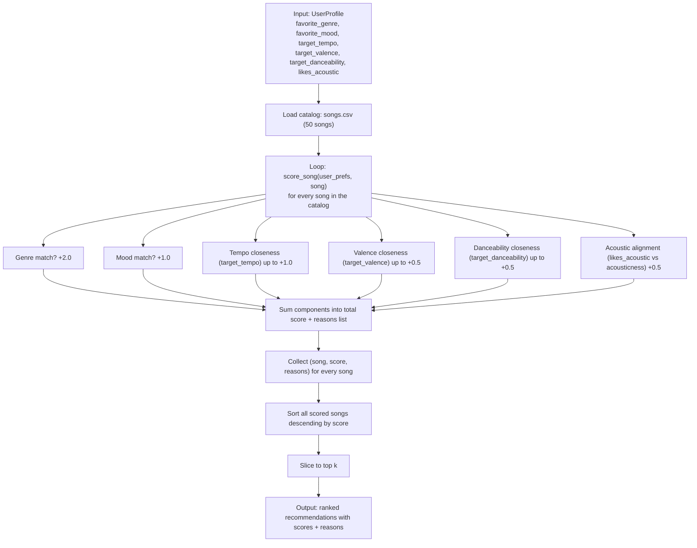

# Data Flow Diagram (Phase 2, Step 4 — Planning Aid)

This is an ungraded sketch of how a single request flows through the recommender, from user input to the final ranked output.

```mermaid
flowchart TD
    A["Input: UserProfile\nfavorite_genre, favorite_mood, target_tempo,\ntarget_valence, target_danceability, likes_acoustic"] --> B["Load catalog: songs.csv (50 songs)"]
    B --> C["Loop: score_song(user_prefs, song)\nfor every song in the catalog"]

    C --> D1["Genre match? +2.0"]
    C --> D2["Mood match? +1.0"]
    C --> D3["Tempo closeness (target_tempo) up to +1.0"]
    C --> D4["Valence closeness (target_valence) up to +0.5"]
    C --> D5["Danceability closeness (target_danceability) up to +0.5"]
    C --> D6["Acoustic alignment (likes_acoustic vs acousticness) +0.5"]

    D1 --> E["Sum components into total score + reasons list"]
    D2 --> E
    D3 --> E
    D4 --> E
    D5 --> E
    D6 --> E

    E --> F["Collect (song, score, reasons) for every song"]
    F --> G["Sort all scored songs descending by score"]
    G --> H["Slice to top k"]
    H --> I["Output: ranked recommendations with scores + reasons"]
```
